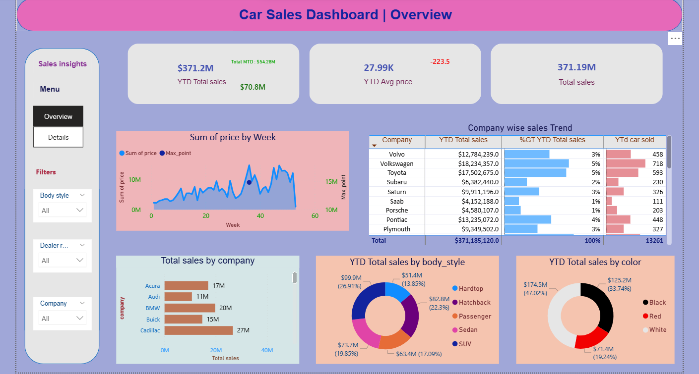

# 🚗 Car Sales Dashboard Analysis

---

## 1. Project Overview
This project analyses car sales data using Power BI to identify key business trends, company performance, and customer preferences.

---

## 2. Key Metrics
- Total Sales (YTD & MTD)  
- Average Price  
- Weekly Sales Trend  
- Company-wise Sales Performance  
- Sales by Body Style  
- Sales by Colour  
- Year-over-Year (YoY) Growth  

## 3. Tools & Technologies
- **Power BI:** Data cleaning & Dashboard development & visualization   

---

## 6. Dashboard Preview
- **Main Dashboard:** [View Dashboard](Car_sales_Dashboard.png)

---

## 7. Key Insights & Business Recommendations

### **1. Sales Performance**
- Total sales are strong (~$371M), but the average price is declining.  
- This indicates pricing pressure or discounting.  
- **Recommendation:** Optimise pricing strategy and introduce premium/bundled offerings.  

---

### **2. Sales Trend**
- Weekly sales show fluctuations with a recent drop.  
- This suggests inconsistent demand or seasonality.  
- **Recommendation:** Improve demand forecasting and plan seasonal campaigns.  

---

### **3. Company Performance**
- Volkswagen, Toyota, and Cadillac are top-performing brands.  
- Some brands show very low contribution and growth (~1–5%).  
- **Recommendation:** Focus on high-performing brands and optimize or reposition low-performing ones.  

---

### **4. Customer Preference (Body Style)**
- SUVs contribute the highest share (~27%).  
- Indicates strong customer preference toward SUVs.  
- **Recommendation:** Expand SUV offerings and align product strategy accordingly.  

---

### **5. Customer Preference (Color)**
- White and Black cars dominate sales, while Red has the lowest demand.  
- **Recommendation:** Align inventory with demand by increasing high-demand colors and reducing low-performing ones.  
